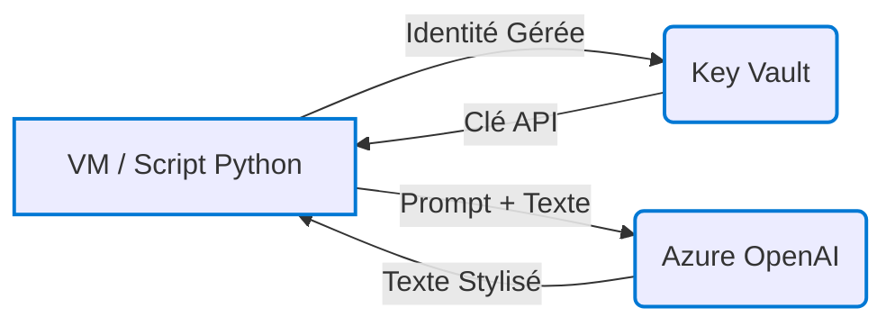

# 🌀 Transformateur de Style de Texte Français (Azure OpenAI)

Ce projet permet de transformer un texte français selon un style donné (`joual`, `argot`, `familier`, `littéraire`) à l'aide d'un modèle de langage hébergé sur Azure OpenAI. L’architecture repose sur des services Azure sécurisés et automatisés.

---

## 🛠️ Fonctionnalités principales

- Transformation automatique de texte selon un style sélectionné.
- Intégration avec Azure OpenAI (`gpt-3.5-turbo`).
- Stockage sécurisé des clés API dans Azure Key Vault.
- Orchestration via un script Python exécuté sur une VM Azure.
- Infrastructure réplicable (template ARM JSON disponible).

---

## 🔧 Architecture Azure



| Ressource           | Détails                                                                 |
|---------------------|-------------------------------------------------------------------------|
| **VM Linux**        | Ubuntu 22.04, SKU: B1s. Script `transform_style.py` hébergé ici.        |
| **Azure Key Vault** | Clé API stockée sous le nom `openaiapikey`. Accès via Identité Gérée.  |
| **Azure OpenAI**    | Modèle `gpt-3.5-turbo`, déployé sous le nom `gpt35turbo`.               |
| **VNet / NSG**      | Sous-réseau protégé, accès SSH restreint à une IP précise.              |
| **Managed Identity**| Attribuée à la VM pour l’accès sécurisé à Key Vault.                    |

---

## 🚀 Déploiement & Fonctionnement

1. **Connexion à la VM via SSH**
2. **Exécution du script :**
   ```bash
   python3 transform_style.py
   ```
3. **Étapes internes du script :**
   - Authentification via l’identité managée.
   - Récupération de la clé API depuis Key Vault.
   - Lecture du prompt selon le style choisi (`prompt_joual.txt`, etc.).
   - Envoi de la requête formatée à Azure OpenAI.
   - Affichage du texte stylisé en retour.

---

## 📌 Exemple de transformation

**Texte original :**  
> Ce matin, je suis allé au travail en bus. Il faisait froid, mais j’ai rencontré un ami et nous avons parlé pendant tout le trajet.

| Style       | Résultat transformé |
|-------------|---------------------|
| **Joual**   | _Ce matin, j'suis allé au travail en autobus. Y faisait frette, mais j'ai capoté, j'ai croisé un chum pis on a jasé toute la ride._ |
| **Argot**   | _Ce matin, j'ai pris le car pour aller au taf. Il caillait grave, mais j'ai chopé un pote et on a kiffé en discutant tout le trajet._ |
| **Familier**| _Ce matin, j'ai pris le bus pour aller au taf. Il faisait frisquet, mais j'ai retrouvé un pote et on a papoté tout le long du trajet._ |
| **Littéraire** | _Ce matin, je me suis rendu à mon lieu d'occupation à bord d'un véhicule de transport en commun. Malgré la rigueur du climat, une rencontre fortuite avec un proche m'a offert l'occasion de converser tout au long du périple._ |

---

## 🛡️ Sécurité

- **Clé API** non stockée localement — récupérée dynamiquement depuis Azure Key Vault.
- **SSH restreint** via NSG à une IP spécifique.
- **Disque OS Standard HDD** pour réduire les coûts.

---

## 📄 Requis

- Abonnement Azure avec droits suffisants.
- Accès à Azure OpenAI avec déploiement valide de modèle.
- Python 3.9+ installé sur la VM.
- Azure CLI (préinstallée sur les images Ubuntu de base).

---

## Notes sur le Déploiement via Template ARM / ARM Template Deployment Notes

Le template ARM exporté (`rg_style_qc_prod_template.json`) permet de recréer la structure principale de l'infrastructure. Cependant, les étapes manuelles suivantes sont nécessaires **après** le déploiement réussi du template :

*The exported ARM template (`rg_style_qc_prod_template.json`) allows recreating the main infrastructure structure. However, the following manual steps are required **after** a successful template deployment:*

1.  **Ajouter le Secret OpenAI / Add OpenAI Secret:** Dans le Key Vault (`keys-joual`) créé par le template, ajoutez manuellement un secret nommé `openaiapikey` avec la valeur de votre clé API Azure OpenAI valide. / *In the Key Vault (`keys-joual`) created by the template, manually add a secret named `openaiapikey` with the value of your valid Azure OpenAI API key.*
2.  **Configurer l'Accès Admin au Key Vault / Configure Admin Access to Key Vault:** Configurez une Politique d'Accès (Access Policy) ou une attribution de rôle RBAC (ex: `Key Vault Secrets Officer`) pour **votre propre utilisateur** sur le Key Vault afin de pouvoir gérer les secrets manuellement si nécessaire. / *Configure an Access Policy or an RBAC role assignment (e.g., `Key Vault Secrets Officer`) for **your own user** on the Key Vault to be able to manage secrets manually if needed.*
3.  **Assigner le Rôle à l'Identité Managée de la VM / Assign Role to VM Managed Identity:** Attribuez le rôle RBAC `Key Vault Secrets User` à l'Identité Managée (System-Assigned) de la nouvelle VM (`vm-qcstyle-transformer`) sur le scope du Key Vault. Ceci est nécessaire pour que le script puisse lire le secret. / *Assign the `Key Vault Secrets User` RBAC role to the new VM's System-Assigned Managed Identity (`vm-qcstyle-transformer`) on the Key Vault's scope. This is necessary for the script to read the secret.*
4.  **Créer le Déploiement OpenAI / Create OpenAI Deployment:** Dans le service Azure OpenAI (`openai-test-joual`) créé, allez dans Azure AI Studio et créez manuellement un déploiement (deployment) du modèle `gpt-3.5-turbo` avec le nom `gpt35turbo`. Le template tente de le créer, mais une vérification/création manuelle est recommandée. / *In the created Azure OpenAI service (`openai-test-joual`), go to Azure AI Studio and manually create a deployment of the `gpt-3.5-turbo` model named `gpt35turbo`. The template attempts to create it, but manual verification/creation is recommended.*
5.  **Configurer l'Accès SSH / Configure SSH Access:** Le template déploie une ressource SSH Public Key mais ne gère pas la clé privée. Vous devrez soit fournir une clé publique existante comme paramètre lors du déploiement, soit générer une nouvelle paire de clés et utiliser la nouvelle clé privée pour vous connecter à la VM déployée. / *The template deploys an SSH Public Key resource but doesn't handle the private key. You will need to either provide an existing public key as a parameter during deployment or generate a new key pair and use the new private key to connect to the deployed VM.*

 ---

## 📬 Contact

Pour toute question ou amélioration, merci de contacter l’administrateur du projet.

