# 🌀 Transformateur de Style de Texte Français (Azure OpenAI)

Ce projet permet de transformer un texte français selon un style donné (`joual`, `argot`, `familier`, `littéraire`) à l'aide d'un modèle de langage hébergé sur Azure OpenAI. L’architecture repose sur des services Azure sécurisés et automatisés.

---

## 🛠️ Fonctionnalités principales

- Transformation automatique de texte selon un style sélectionné.
- Intégration avec Azure OpenAI (`gpt-3.5-turbo`).
- Stockage sécurisé des clés API dans Azure Key Vault.
- Orchestration via un script Python exécuté sur une VM Azure.
- Infrastructure réplicable (template ARM JSON disponible).

---

## 🔧 Architecture Azure

```mermaid
graph LR
    A[VM / Script Python] --> |Identité Gérée| B(Key Vault);
    B --> |Clé API| A;
    A --> |Prompt + Texte| C(Azure OpenAI);
    C --> |Texte Stylisé| A;

classDef azure stroke:#0078D4,stroke-width:2px;
class A,B,C azure;
```



| Ressource           | Détails                                                                 |
|---------------------|-------------------------------------------------------------------------|
| **VM Linux**        | Ubuntu 22.04, SKU: B1s. Script `transform_style.py` hébergé ici.        |
| **Azure Key Vault** | Clé API stockée sous le nom `openaiapikey`. Accès via Identité Gérée.  |
| **Azure OpenAI**    | Modèle `gpt-3.5-turbo`, déployé sous le nom `gpt35turbo`.               |
| **VNet / NSG**      | Sous-réseau protégé, accès SSH restreint à une IP précise.              |
| **Managed Identity**| Attribuée à la VM pour l’accès sécurisé à Key Vault.                    |

---

## 🚀 Déploiement & Fonctionnement

1. **Connexion à la VM via SSH**
2. **Exécution du script :**
   ```bash
   python3 transform_style.py
   ```
3. **Étapes internes du script :**
   - Authentification via l’identité managée.
   - Récupération de la clé API depuis Key Vault.
   - Lecture du prompt selon le style choisi (`prompt_joual.txt`, etc.).
   - Envoi de la requête formatée à Azure OpenAI.
   - Affichage du texte stylisé en retour.

---

## 📁 Arborescence du projet

```
.
├── transform_style.py
├── prompts/
│   ├── prompt_joual.txt
│   ├── prompt_argot.txt
│   ├── prompt_familier.txt
│   └── prompt_litteraire.txt
├── rg_style_qc_prod_template.json (optionnel)
└── README.md
```

---

## 📌 Exemple de transformation

**Texte original :**  
> Ce matin, je suis allé au travail en bus. Il faisait froid, mais j’ai rencontré un ami et nous avons parlé pendant tout le trajet.

| Style       | Résultat transformé |
|-------------|---------------------|
| **Joual**   | _(à insérer après test)_ |
| **Argot**   | _(à insérer après test)_ |
| **Familier**| _(à insérer après test)_ |
| **Littéraire** | _(à insérer après test)_ |

---

## 🛡️ Sécurité

- **Clé API** non stockée localement — récupérée dynamiquement depuis Azure Key Vault.
- **SSH restreint** via NSG à une IP spécifique.
- **Disque OS Standard HDD** pour réduire les coûts.

---

## 📄 Requis

- Abonnement Azure avec droits suffisants.
- Accès à Azure OpenAI avec déploiement valide de modèle.
- Python 3.9+ installé sur la VM.
- Azure CLI (préinstallée sur les images Ubuntu de base).

---

## 📬 Contact

Pour toute question ou amélioration, merci de contacter l’administrateur du projet.

